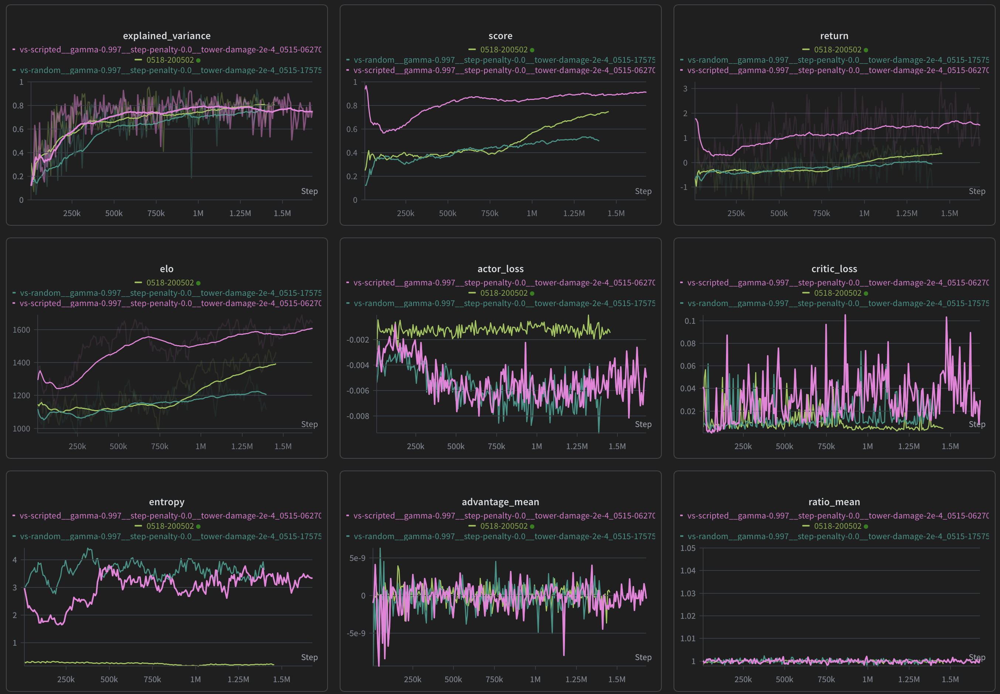

# Clash Royale RL Playground

A custom tick-based game engine simulating Clash Royale, written in Python. Pygame is used to render game states at each tick. 
The primary goal is not an identical replica, but rather a performant reinforcement learning (RL) playground for agent training and experimentation.

## Running the Environment & Training

The repository includes a custom PPO trainer designed to interface with the parallelized Gymnasium environment.

### 1. Training the Agent

To start a standard PPO training run with parallel environments:

```bash
python ppo_trainer.py --num_envs 8
```

**Common Flags:**
- `--num_envs <int>`: Number of parallel environment workers (default: 1).
- `--overfit_mode <mode>`: Test against specific profiles: `single-buffer`, `fixed-opponent`, `vs-random`, `vs-skip`, or `vs-scripted`.
- `--profile`: Runs exactly two PPO updates and prints detailed timing statistics for buffer collection, GAE computation, and network updates before exiting. Useful for diagnosing CPU/GPU bottlenecks.
- `--no-wandb_logging`: Disable Weights & Biases logging (enabled by default).
- `--resume_run <run_id>`: Resume a previous run by providing its timestamped run name.

### 2. Environment Profiling & Benchmarking

If you are modifying the engine physics or observation wrappers and want to test environment throughput (Steps/Sec) directly without network overhead:

```bash
python profiling.py
```

This script will run a heavy workload on both a single environment and an 8x parallel environment manager, reporting the exact FPS. To dive deeper and print micro-benchmarks for engine components (like `arena.update`), use the environment variable guard:

```bash
PROFILE_ENV=1 python profiling.py
```

### 3. Debug Mode

For quick iterations, run the trainer in debug mode. This drastically reduces buffer sizes, minibatch sizes, disables wandb logging, and enables verbose output:

```bash
python ppo_trainer.py --debug
```

---
# Latest Progress



### Summary
- Magenta: Run 12
    - overfit mode: vs-scripted
- Dark Green: Run 14
    - overfit mode: vs-random
- Light Green: Run 16
    - overfit mode: vs-random
    - elixir based forced card or full skip

Latest run is a big deal coz it is able to surpass the 75% winrate while anything above 55% is considered pretty good. So the current network and training approach is finally strong enough to proceed to real self-play dynamics.

### Gameplay:
<video controls src="readme-assets/run-16_gameplay_1.48M.mp4" title="Run-16 Gameplay after 1.48M Steps"></video>
https://github.com/user-attachments/assets/83912232-d85e-4d70-85af-cf0871923717


### Other distinctive features:
- [pro] very clear score, reward and elo upward trend
- [pro] gameplay wise: the position distribution are extremely sharp unlike ever before
- [con] seems like its completely given up on knight and giant! perhaps adding in the rest of the 5 cards to complete the deck can prevent this imbalance
